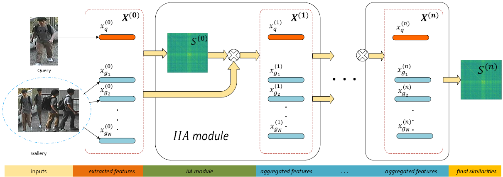

# Improving Person Re-Identification With Iterative Impression Aggregation (IIA)

The repository is for our TIP paper [Improving Person Re-Identification With Iterative Impression Aggregation](https://arxiv.org/abs/2009.10066).



## Requirements
- torch >= 1.0

## Extracted Features
The MGN features we used can be download at [MGN](https://drive.google.com/drive/folders/1NaWkKzsvL_LSx-j5eoZp71l3v9i64ek1?usp=sharing).

## How to use
Please follow the usage of our demo.py script. If you have downloaded our extracted features, you may run like the following:
```shell
### online 
python demo.py --dname market --fpath mgn_market.pkl
### offline
python demo.py --dname market --fpath mgn_market.pkl --off
```
This (IIA_bas) will give 93.73 mAP and 89.60 mAP for Market-1501 and DukeMTMC respectively, which are slightly higher than paper reported.

## Citation
If you find this code useful for your research, please cite our paper.
```
@article{fu2020improving,
  title={Improving Person Re-Identification With Iterative Impression Aggregation},
  author={Fu, Dengpan and Xin, Bo and Wang, Jingdong and Chen, Dongdong and Bao, Jianmin and Hua, Gang and Li, Houqiang},
  journal={IEEE Transactions on Image Processing},
  volume={29},
  pages={9559--9571},
  year={2020},
  publisher={IEEE}
}
```